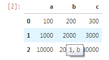
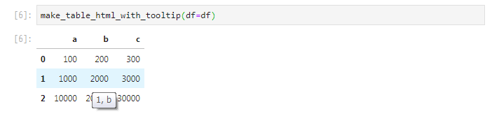

# Pandas Table Tooltip

Pandas Table Tooltip is a Python librarythat only adds index and column tooltips to Pandas tables on Jupyter.  
It is useful to understand the values of column and index when displaying a long table on Jupyter.



# Intalling

```
$ pip install pandastabletooltip
```

# Usage

```py
from pandastabletooltip import make_table_html_with_tooltip
import pandas as pd

df = pd.DataFrame(data=[{
    'a': 100,
    'b': 200,
    'c': 300,
}, {
    'a': 1000,
    'b': 2000,
    'c': 3000,
}, {
    'a': 10000,
    'b': 20000,
    'c': 30000,
}])

make_table_html_with_tooltip(df=df)
```

And then, the table displayed by the above function will show index and column values when mouse over:




